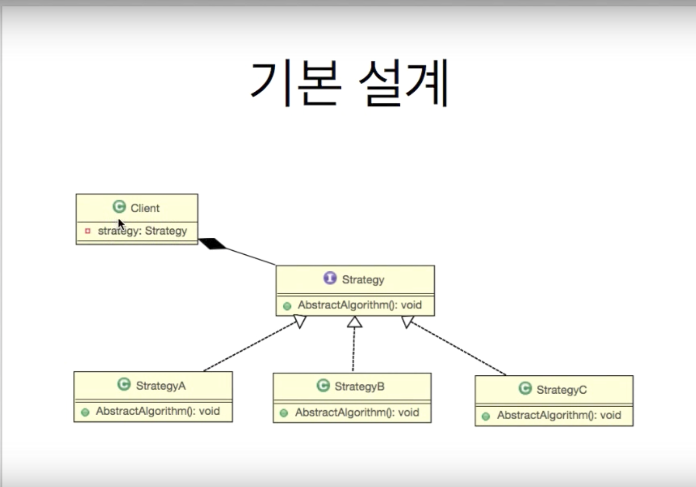

Strategy pattern

목표
인터페이스 개념을 이해
델리게이트 개념을 이해
전략 패턴 개념을 이해


---
사전적 인터페이스
키보드 등처럼 사람과 컴퓨터를 연결하는 장치
java interface
-기능에 대한 선언과 구현을 분리
-기능을 사용 통로

```
public interface Ainterface {
    // 기능에 대한 선언
    public void funcA()
}

public class AinterfaceImpl implements Ainterface{
    @Override
    public void fincA(){
        print("AAA");
    }
}


public class Main{
    Ainterface ainterface = new AinterfaceImpl();
    //통로
    ainterface.funcA();
}
```


델리게이트
-위임하다.
-두 객체간의 관계에서


```
public class AObj {

	Ainterface ainterface;

	public AObj(){
		ainterface = new AinterfaceImpl();
	}

	public void funcAA() {

		//위임한다. -다른 객체의 기능을 사용한다.
		ainterface.funcA();//		System.out.println("AAA");
		ainterface.funcA();//		System.out.println("AAA");
		//~ 기능이 필요합니다.
	}
}
```


### Strategy pattern
#### 여러 알고리즘을 하나의 추상적인 접근점을 만들어 접근 점에서 서로 교환 가능하도록 하는 패턴



```
public interface Weapon {
	public int doAttact();
}

public class Knife implements Weapon {
	public int doAttact() {
		System.out.println("칼 공격");
		return 0;
	}
}

public class Sword implements Weapon {
	public int doAttact() {
		System.out.println("검 공격");
		return 0;
	}
}

public class GameCharacter {
	private Weapon weapon;
	public int attact() {
        // 델리게이트
		return weapon.doAttact();
	}
	public void setWeapon(Weapon weapon) {
		this.weapon = weapon;
	}
}

public static void main(String[] args) {
    GameCharacter character = new GameCharacter();

    character.setWeapon(new Sword());
    character.attact();

    character.setWeapon(new Knife());
    character.attact();
}

```
