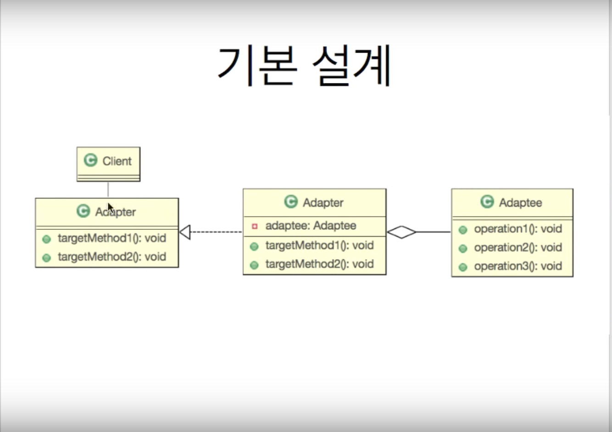

목표

알고리즘을 요구사항에 맞춰 사용할 수 있다.

사전적 adapter : 다목적으로 사용하기 위한 부가 기구




```
//원하는 것은 float이나 double 로 반환되고 있다.
public class Math {
	public static double twoTime(double num){return num*2;}//두배
	public static double half(double num){ return num/2; }//절반
	//강화된 알고리즘
	public static Double doubled(Double d){return d*2;}
}

public interface Adapter {
	public Double twiceOf(Float num);
	public Double halfOf(Float num);
}

public class AdapterImpl implements Adapter {
	@Override
	public Double twiceOf(Float num) { return Math.doubled(num.doubleValue()); }
    @Override
	public Double halfOf(Float num) { return Math.half(num); }
}

public static void main(String[] args) {
    //요구사항을 수행하는 인스턴스
    Adapter target = new AdapterImpl();
    System.out.println(target.twiceOf(100.0f));
    System.out.println(target.halfOf(100.3f));
}

```


## 연관성 없는 두 객체를 묶어 사용하는 패턴이다.
