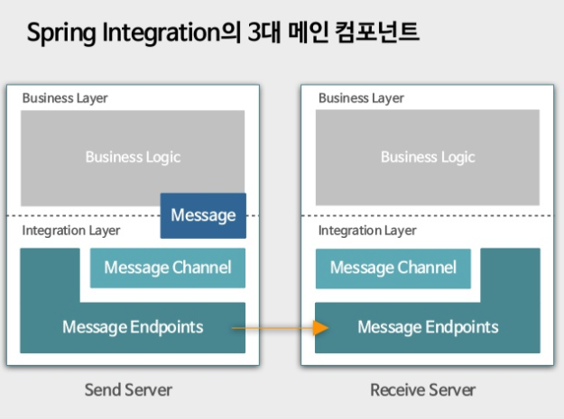
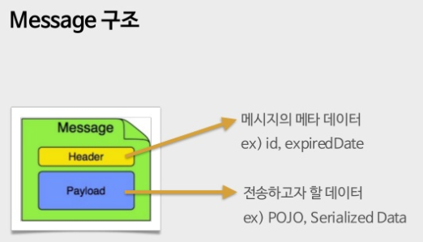
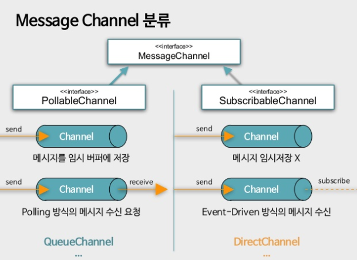
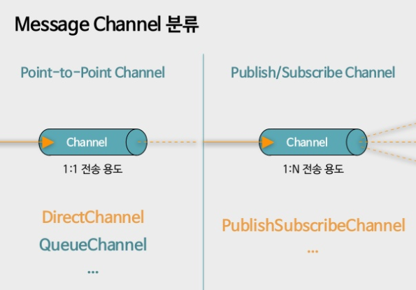
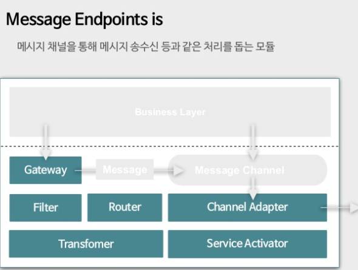
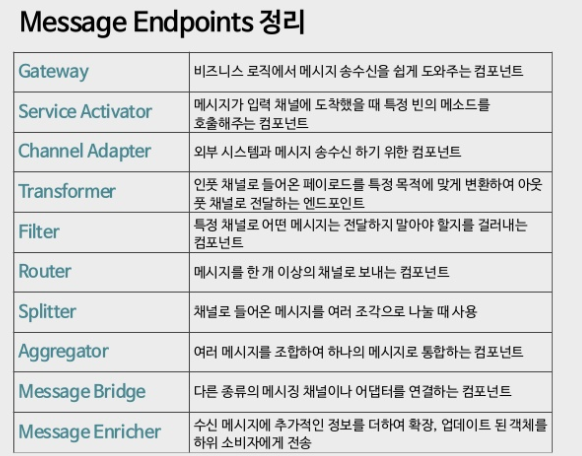

## SpringIntegration 

### 이것은 무엇인가?!


### 이것의 구조는 ?!

### 이것을 어떤부분에 적용할것인가?!

### 이것의 테스트 샘플은?!


[Spring integration을 통해 살펴본 메시징 세계](https://www.slideshare.net/WangeunLee/spring-integration-47185594)
### 1. spring integration ? 뭐고 왜 쓰는건지?

Messaging : 프로그램간에 빠르고 신뢰할 수 있는 통신을 비동기 방식으로 가능케 하는 전송기술

메시징을 기준으로 패턴화도 진행되어 왔다.

그 패턴을 구현한 프레임워크가 바로 Spring Integration

그중에서 왜 하필 Spring Integration 인가?
1. 간편한 설정 : XML /JAVA DSL을 이용한 간편한  Infrastructure 구축
2. 익숙한 환경 : Spring Framework의 IOC, DI 사용
3. 다양한 Connectivity : 다양한 통신 기술에 대한 Adapter 및 Infrastructure 제공


### 2. 어떻게 쓰는건지?
dddd
:w


```
Spring Integration History
2007.11.13 - Spring Integration First Commit
2008.01.23 = 1.0.0.M1
2008.11.26 = 1.0.0
2013.12.15 = 3.0

현재 5.0.0
```

세가지만 기억하세요!
Message / Pipes / Filters

Message(-> Message) : 전송할 데이터가 담긴 Wrapper Class
Pipes(-> Message Channel) : Message 오브젝트를 발신 / 수신 하기 위한 창구
Filters(-> Message Endpoints) : Message 오브젝트를 발신 / 수신하는 목적지







Message 생성방법
1. 직접 메시지 인스턴스화 진행
```
Message<String> message1 = new GenericMessage<>("Hello");
Message<User> message2 = new GenericMessage<>(user);
```
2. 메시지 빌더를 사용하여 메시지 오브젝트 생성
```
Message<String> message1 = MessageBuilder.withPayload("Hello").build();
Message<User> message2 =  MessageBuilder.withPayload(user).build();
```








Gateway (SimpleGateway) -> Channel -> TcpOutboundGateway -> <==Socket==> -> TcpInboundGateway -> Channel -> ServiceActivator (EchoService)


