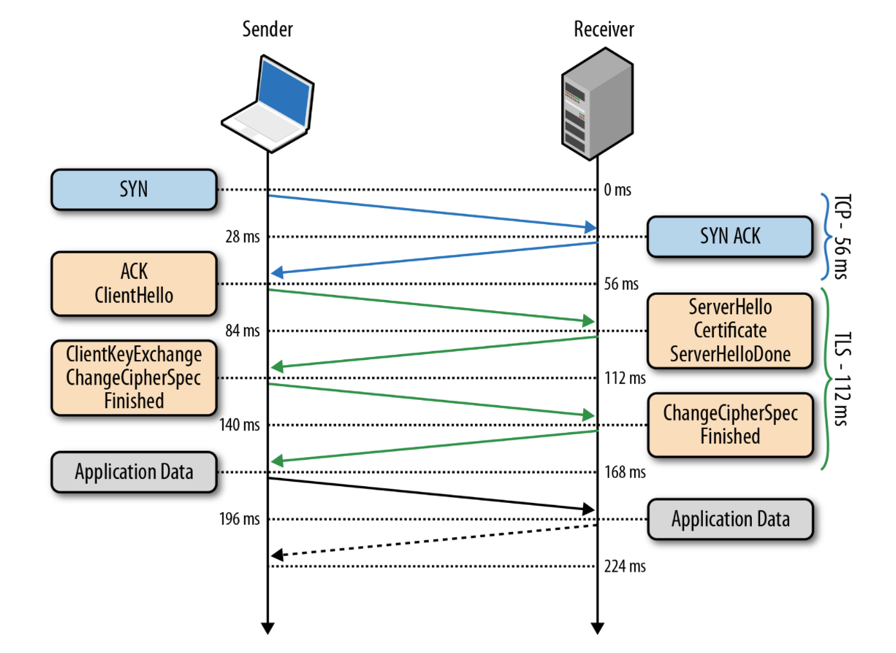

### HTTPS는 HTTP 보다 빠르다.
#### - 21세기에 HTTP를 쓰는, HTTPS가 HTTP보다 무겁고 느리다고 믿는 웹서버 관리자들에게 고함

http는 해커의 공격 및 스니핑에 매우 취약한 프로토콜이다.
https를 사용하지 않으면 이 사이트가 진짜인지 가짜인지 판별하기 어려운 경우가 많다.

https 는 http 프로토콜에 SSL/TLS 레이어를 입힌 형태로 구현되었다.

이러한 간단한 구현은 서버와 클라이언트 모두에게 몇몇 문제를 낳았습니다.

!!! 암호화 비용
https는 실제 통신이 이루어지기 전에 적으면서도 많은 과정(handshake)가 필요하다.


과거에 이러한 부분이 http 서버를 https로 전환하는데 매우 큰 걸림돌이 되었으며
이는 아직까지 많은 서버 개발자 및 관리자의 머리속에
"HTTPS는 느리고 서버 부하가 크다"라고 이미지화 되었다.

하지만.

2010년 이후 https 암호화에 쓰이는 TLS 는 크게 변한 것이 없는데 반해,
클리이언트와 서버에 쓰이는 CPU와 메모리 모두 성능이 과거와는 비교할 수 없을 정도로 매우 좋아졌습니다.

CPU는 충분히 빨라졌습니다.
세대가 진화할수록, 새로운 공정이 사용될수록 과거와 비교해 성능차가 점점 커지고 있고
이는 통신 암호화에 더 유리한 환경을 조성하는데 큰 기여를 한 부분이 되었다.
“우리가 사용하는 프론트엔드 장비에서, SSL/TLS는 1% 이하의 CPU 사용량과 연결당 10KB 이하의 메모리 그리고 2% 이하의 네트워크 오버헤드를 가졌습니다. 많은 사람들이 SSL/TLS가 많은 CPU 사용을 요구한다고 믿고 있지만 우리는 앞서 보여준 숫자들이 그들의 편견을 떨쳐버리는데 도움이 됐으면 좋겠습니다.” -Adam Langley, Google-

구글의 경우 2010년 Overclocking SSL 이라는 글을 내면서 위와 같이 말했으며 이 글에서는 다음 내용을 강조하고 있습니다:
```
SSL/TLS is not computationally expensive any more. (SSL/TLS는 더 이상 값비싼 부분이 아닙니다.)
```

구글은 2012년에 SPDY라는 새로운 네트워킹 프로토콜을 공개 발표했습니다.
이 프로토콜은 본질적으로 다중화(multiplexing), 우선 순위(prioritizing)를 이용해
한 TCP 연결 하에 웹 페이지 로드 속도를 더 빠르게 하기 위한 프로토콜로 공개되었습니다.
이후 이 프로토콜은 HTTP/2의 기반이 되어 2015년 3월 14일, RFC 7540 표준으로 오르게 되었습니다.

2월, 크롬이 업데이트 되면서 네이버가 안전하지 않은 웹 사이트로 나타나는 문제가 있었습니다.
이에 대해 네이버는 “메인 페이지에는 개인정보가 들어가 있지 않고 공개된 정보가 대부분으로,
로그인 창과 검색창에는 https를 적용하고 있다”라고 밝혀 논란이 됐었습니다. 무엇이 문제인지 알아봅시다.

개인정보를 주고 받는 것도 아닌데 왜 암호화를 해야할까요?
이 문제는 수많은 국가들이 시행하고 있는 인터넷 검열(internet censorship) 문제로 이어집니다.
한국의 경우 DPI(deep packet inspection)를 통해 인터넷 검열을 하고 있는 국가이며,
암호화되지 않은 모든 HTTP 통신을 가로채 Host 헤더를 보고 차단 여부를 판단하는 방식을 도입하고 있습니다.
근본적인 문제는 여기서 시작됩니다.
각 국가의 정부 또는 ISP는 사용자가 어느 사이트에 접속하는지 어떤 행동을 하는지 모두 감시할 수 있으며,
이를 이용해 어떤 사용자가 news.naver.com 이라는 도메인 요청을 보냈었고
news.naver.com에서 어느 뉴스를 보고 있는지를 통해 해당 사용자를 구분하고 활동을 감시할 수 있게 됩니다.
DNS 요청 또한 중간에서 들여다보아 처음에는 a.example.com에 있다가
어느 시점에 b.example.com에 접속을 시도했다는 것을 알 수 있게 되죠.
즉, 근본적인 문제는 인터넷 검열입니다. 모든 사용자의 행동 및 정보는 보호받아야 할 권리가 있으며
누군가가 이를 들여다볼 수 있는 여지가 생기면 안됩니다.

HTTPS 인증서 비용
서버 관리자들이 HTTPS 도입을 꺼려하는 가장 많은 이유 중 하나는 HTTPS 인증서에 대한 비용입니다.
과거에는 HTTPS 인증서를 발급받기 위해 신뢰할 수 있는 루트 인증 기관인
Comodo, VeriSIgn, Symantec, GeoTrust, Thawte 등을 이용해야 했지만,
이러한 고충을 잘 알고있고 HTTPS의 빠른 보급을 원하는 Cisco, Google, Mozilla, Fastly 등의 재단 및 회사들은
 Let’s Encrypt라는 이름의 무료로 HTTPS 인증서를 보급해주는 기관을 만들었습니다.
 이 기관을 통해 다양한 개발자 및 관리자들은 손쉽게 무료로 HTTPS 인증서를 발급받을 수 있는 수단을 얻을 수 있게 됐고 이는 2017년 현재 HTTPS 보급에 가장 큰 공을 세우고 있습니다.


 HTTPS로 전환하는 과정에서 크게 복잡한 부분은 없습니다.
 다만 꼭 참고해야 할 부분은 웹 브라우저 policy로 인해 HTTPS에서 HTTP로 날리는 일부 요청은 제한된다는 부분입니다.
 특히 HTTPS 페이지에서 HTTP 프로토콜 페이지에 있는 스크립트를 불러올 때는 무조건 요청이 제한되며 웹 소켓 연결 또한 제한됩니다.
 이를 위해 HTTPS 전환은 충분한 검토 및 테스트 후에 이루어져야 합니다.
 2017년 현재 대부분의 웹 서버가 HTTP/2를 거의 완전히 지원하고 있습니다.
 Apache는 2.4.12 버전부터 mod_h2 모듈을 통해 지원하고 있고,
 nginx는 1.9.5(아래 버전은 SPDY 사용)부터, node.js는 5.0부터 지원하고 있습니다.
  적용 방법은 각 서버별로 상이하니 찾아보시면 되겠습니다.
