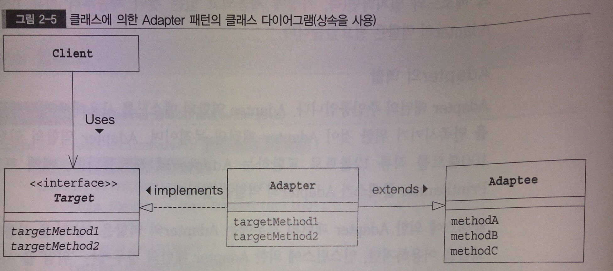
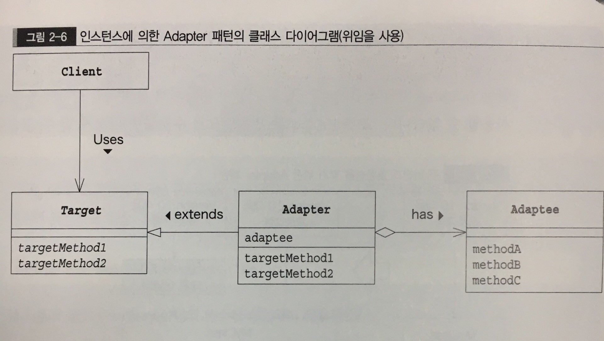

# Adapter pattern
- 바꿔서 재이용하기

adapter 패턴은 wrapper패턴으로 불리기도 한다.
무엇인가를 포장해서 다른 용도로 사용할 수 있게 교환해 주는 것 같아서...

## 종류
1. 클래스에 의한 Adapter 패턴(상속을 사용한 Adapter 패턴)

2. 인스턴스에 의한 Adapter 패턴(위임을 사용한Adapter 패턴)

## 역할
### Target(대상)
    지금 필요한 메소드를 결정합니다.
### Client(의뢰자)
    Target 역할의 메소드를 사용해서 일을합니다.
### Adaptee(개조되는 쪽)
    이미 준비되어 있는 메소드를 가지고 있다.
### Adapter
    Adapter 패턴의 중인공, Adaptee의 역할의 메소드를 사용해 어떻게든 Target 역할을 만족시키기 위한 것.

