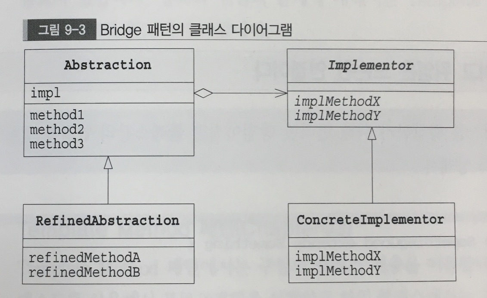

# Bridge pattern
- 기능 계층과 구현 계층 분리하기
- 두 장소를 연결하는 역할

## 기능 클래스의 계층
새로운 기능을 추가하려는 경우 클래스 계층 안에서 자신의 목적과 가까운 클래스를 찾아내 그 하위 클래스를 만들어
목적한 기능을 추가로 새로운 클래스를 만든다는 것이 기능의 클래스 계층입니다.
```
    상위 클래스는 기본적인 기능을 가지고 있다.
    하위 클래스는 새로운 기능을 추가한다.
```

## 구현의 클래스 계층
```
    상위 클래스는 추상 메소드에 의해 인터페이스(API)를 규정한다.
    하위 클래스는 구상 메소드에 의해 인터페이스(API)를 규정한다.
```



## 등장인물
    1.Abstraction(추상화)
    - 기능의 클래스 계층의 최상의 클래스
    2. RefinedAbstraction  : 개선된 추상화
    3. Implementor (구현자)
    - '구현의 클래스 계층'의 최상의 클래스
    4. Concrete Implementor(구체적인 구현자)

**상속은 견고한 연결이고 위임은 느슨한 연결이다.**

.................
