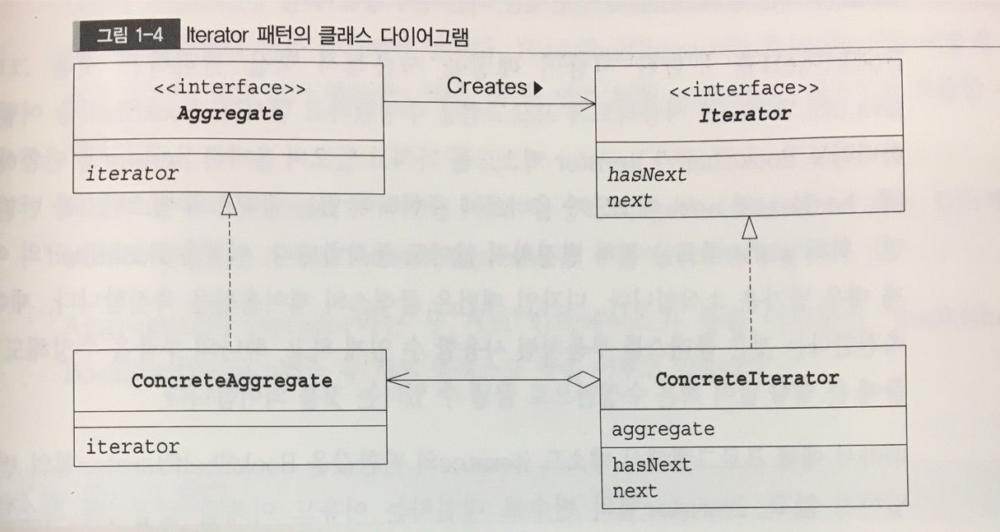

# Iterator pattern
: 무엇인가 많이 모여있는 것들을 **순서대로** 지정하면서 전체를 검핵하는 처리를 실행하기 위한 패턴

## 다이어 그램

## 역할 
- Aggregate(집합체)의 역할
  :  Iterator 역할을 만들어내는 인터페이스(API)를 결정합니다.
- ConcreateAggregate(구체적인 집합체)의 역할
  :  Aggregate 역할이 결정한 인터페이스(API)를 실제로 구현하는 일을 합니다.
- Iterator(반복자)의 역할
  :  요소를 순서대로 검색해가는 인터페이스(API)를 결정합니다.
- ConcreateItertor(반복자)의 역할
  :  Iterator가 결정한 인터페이스(API)를 실제로 구현하는 일을 합니다.

## 기타
    - 인터페이스 없이 클래스만 사용하면 클래스간의 결합이 강해져, 부품으로 재이용하는 일이 어렵다.
  추상 클래스나 인터페이스를 사용해 프로그래밍을 한다는 사고방식을 기억해두어야 한다.
    - 'next'는 틀리기 쉽다. 현재요소를 반환하면서, 다음위치로 진행하는것.
    - 'hasNext'도 틀리기 쉽다. 최후의 요소를 얻기전에는 true값을 반환하지만, 최후의 요소를 얻은 후에는 false값을 반환하기에 주의하여 작성하지 않으면 최후의 1개 값을 반환하지 못한 위험이 있습니다. '다음에 next메소드를 불러도 괜찮은지 조사하는것' 이라고 기억해두면 좋을 것이다.

