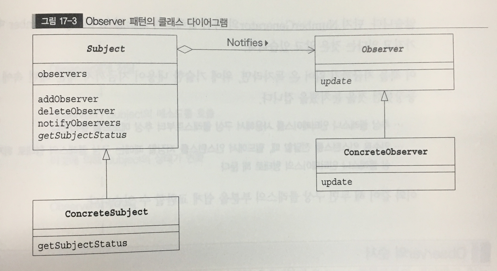

# Observer pattern
- 상태의 변화를 알려주기(관찰 대상의 상태가 변화하면 관찰자에게 알려 줍니다.

## Subject(관찰 대상자)의 역할
관찰 되는 대상. 등록하는 메소드와 삭제하는 메소드를 가지며, '현재의상태를 취득하는 ' 메소드도 선언되어 있다. 

## ConcreteSubject(구체적인 관찰 대상자)의 역할
구체적으로 관찰 되는 대상.
상태가 변화하면 그것이 등록되어 있는 Observer 역할에 전합니다.

## Observer(관찰자)의 역할
Subject 역할로부터 '상태가 변했습니다'라고 전달받는 역할을 합니다. 이를 위한 메소드는 update 입니다.

## concreateObserver(구체적인 관찰자)의 역할
구체적인 Observer . 
update 메소드가 호출되면 그 메소드 안에서 Subject 역할의 현재상태를 취득합니다.

### 관찰 하기보다 전달 받기를 기다린다.
observer는 관찰자의 의미이나 실제로는 능동적으로 관찰한다기 보다
subject로 부터 전달 되는 것을 수동적으로 기다린다.

Publish-subscrive 패턴이라고도 하는데, 발행과 구독이라는 표현이 더 적당할 수도 있다.

