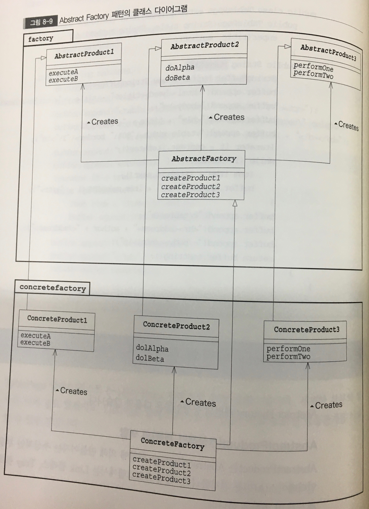

# Abstract Factory Pattern
- 관련 부품을 조립하여 제품만들기
- 추상적인 공장에서는 추상적인 부품을 조합하여 추상적인 제품을 만듭니다.

1. AbstractProduct(추상적인 제품)의 역할
Abstract Factory 역할에 의해 만들어지는 추상적인 부품이나 제품의 인터페이스를 결정합니다.

2. AbstractFactory(추상적인 공장)의 역할
AbstractFactory 는 AbstractProduct 역할의 인스턴스를 만들어 내기위한 인터페이스를 결정합니다.

3. Client(의뢰자)의 역할
Client 는 AbstractFactory 역할과 AbstractProduct 역할의 인터페이스만을 사용해 주어진 역할을 실행합니다. 구체적인 부품이나 제품, 공장에 대해서는 모릅니다.

4. ConcreateProduct(구체적인 제품)의 역할
ConcreateProduct 는 AbstractProduct 역할의 인터페이스를 구현합니다.

5. ConcreateFactory(구체적인 공장)의 역할
ConcreateFactory는 AbstractFactory 역할의 인터페이스를 구현합니다.

보강.
인스턴스 만드는 법
1. new : 일반적으로 사용, 예약어 new 사용해 만듬
2. clone : 자신을 기초하여 인스턴스를 만들수 있다.(단, 생성자는 호출되지 않는다.)
3. newInstance : Class의 인스턴스를 기초로 그 Class가 표시하고 있는 클래스의 인스턴스를 만들수 있다.(인수 없는 생성자가 호출됩니다.)

