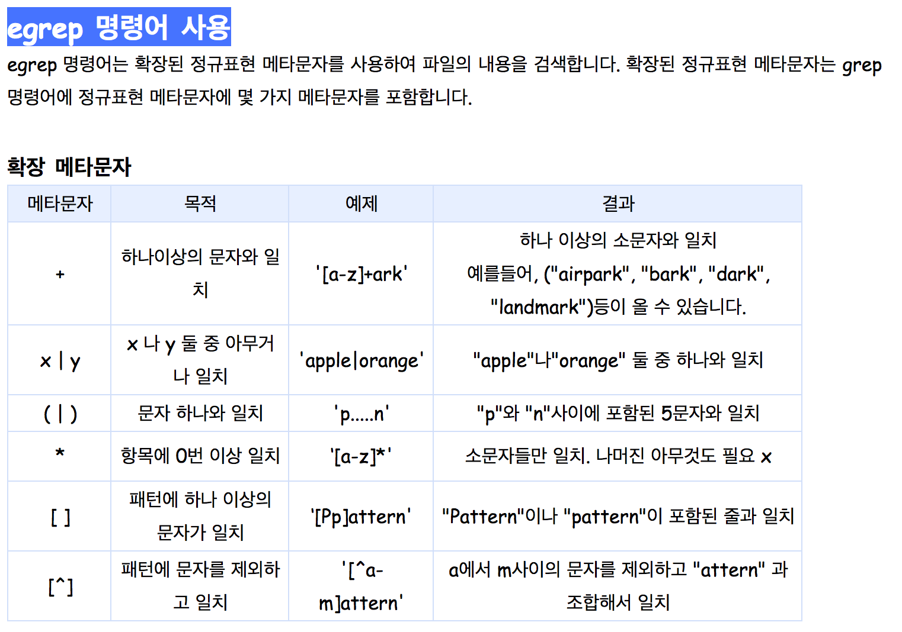
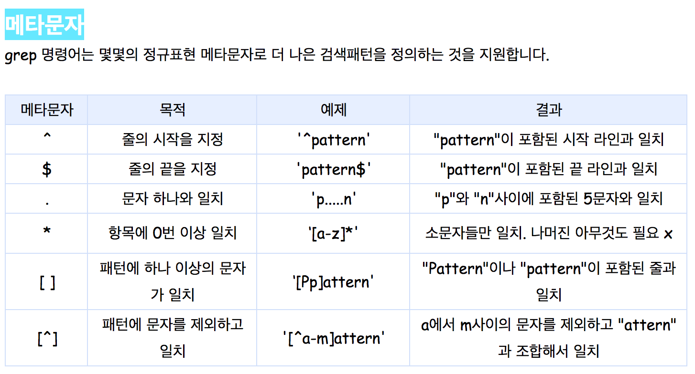

## grep

global / regular expression / print
grep는 파일이나 표준입력을 검색하여 주여진 정규표현식과 맞는 줄을 찾아 프로그램의 표준으로 출력한다.

기본옵션
-c : 패턴이 일치하는 행의 수 출력
-i : 비교시 대소문자를 구별 안함
-v : 지정한 패턴과 일치하지 않는 행만 출력
-n : 행의 번호와 함께 출력
-I : 패턴이 포함된 파알의 이름을 출력
-w : 패턴이 전체단어와 일치하는 행만 출력

fgrep : 정규표현식을 사용하지 않음
grep : 정규표현식을 사용함
egerp : 정규표현식과 확장표현식을 사용

