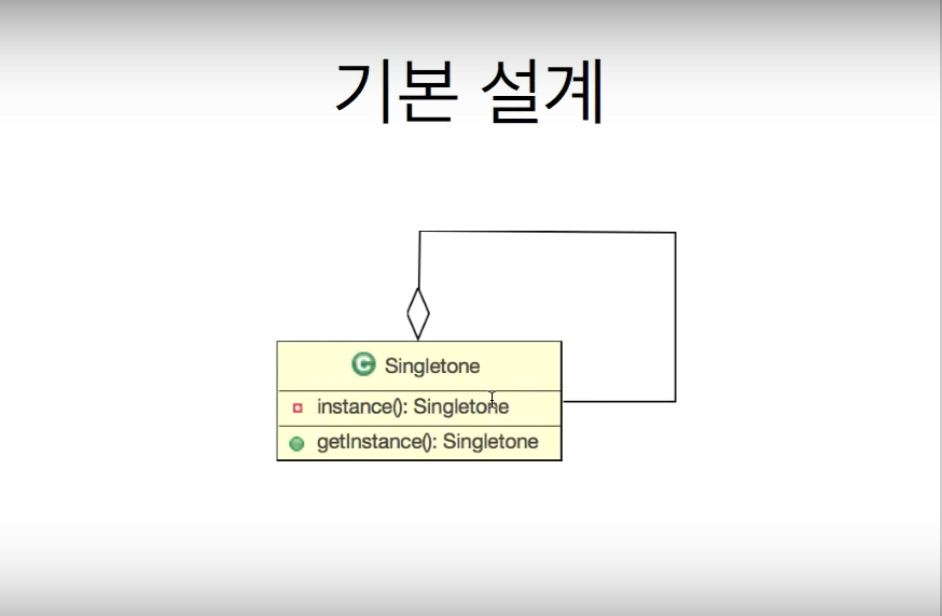

Singleton pattern

객체란?
객체 : 속성과 기능을 갖춘것.(자동차)
클래스 : 속성과 기능을 정의한것(설계도)
인스턴스 : 속성과 기능을 가진 것 중 실제하는 것


객체 > 클래스
객체 > 인스턴스


목표 : 하나의 인스턴스만 생성할 수 있다.




```
public class SomeSystemComponent {

	private static SomeSystemComponent instance;

	private SomeSystemComponent() {

	}

	public static SomeSystemComponent getInstance(){
		if (instance == null) {
            // 시스템 스피커
			instance = new SomeSystemComponent();
		}
		return instance;
	}
}

public static void main(String[] args) {
    SomeSystemComponent component = SomeSystemComponent.getInstance();

}
```
