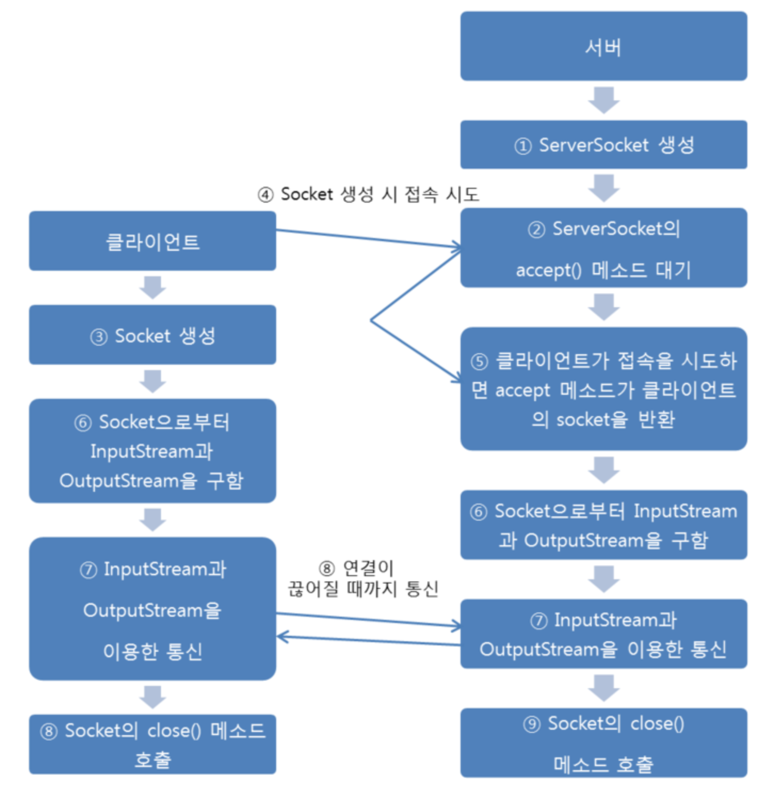

# TCP ? 

tcp란소켓 프로그래밍 중의 하나로 스트림 통신 프로토콜이라고 부르며, 양쪽의 소켓이 연결된 상태여야만 가능하기 때문에
연결 지향 프로트콜이라고도 합니다.

TCP 프로토콜은 신뢰성 있는 프로토콜이기 때문에, 송신한 쪽의 데이터가 수신측에 차례대로, 중간에 유실되는 일없이
도착하는 것을 의미한다. 그러려면 수신 측과 송신 측이 미리 연결을 맺고 연결된 수서대로 데이터를 교환해야합니다.

신뢰성이는 TCP 연결을 하기 위해서는 TCP 프로그래밍에서 사용하는 라이브러리의 사용방법과 동작순서를 정확하게 숙지,
이해하고 있어야 합니다. 특히 자바는 TCP 프로그래밍을 쉽게 할 수 있도록 java.net 패키지에 관련 클래스들을 미리
준비해놓고 있기 때문에, 해당 패키의 클래스를 알맞게 사용할 수 있어야 합니다.

TCP프로그래밍에서 중요한클래스는 다음과 같습니다.
 - Java.net.ServerSocket : 서버쪽에서 클라이언트의 접속을 대기하기 위해서 반드시 필요한 클래스
 - Java.net.Socket : 서버와 클래이언트가 통신하기 위해서 반드시 필요한 클래스

 각각 서버와 클라이언트를 사용하는 클래스는 위와 같으며, 통신 순서는 아래와 같다.

 

